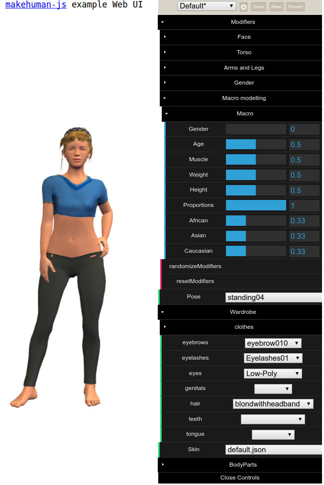

# makehuman-js example ui

Example web app using [makehuman-js](https://github.com/makehuman-js/makehuman-js)

Live version at [makehuman-js-example.wassname.com](http://makehuman-js-example.wassname.com/) (NSFW while loading)

## Install and run

- clone the repository
- run `npm install`
- run `npm start`
- open http://localhost:8080 in the browser

## Development environment

If you want to edit makehuman-js and makehuman-data as well you will want to set up a development environment with "npm link" and `webpack --watch`.
- clone this repo, makehuman-js, and makehuman-js-data into two more seperate folders
- register makehuman-js, and makehuman-js-data using the command [`npm link`](https://medium.com/@alexishevia/the-magic-behind-npm-link-d94dcb3a81af).  This way imports will use your local code (read more [here](http://justjs.com/posts/npm-link-developing-your-own-npm-modules-without-tears)).
- install dev dependancies in the makehuman-js folder with `npm install --dev`
- install dependencies in the makehuman-js-example folder with `npm install`
- go into the makehuman-js folder in a seperate terminal and run `npm run watch`. This will have webpack watch for changes to the source code (such as human.js) and if it sees any it will regerate makehuman.js. Leave this running while you develop.
  - You may also need to install webpack globally to make the command available in the terminal: `npm install -g webpack@2.1.0`
- now you can go to makehuman-js-example folder and run `npm start`
- open http://localhost:8080 in the browser
- you will see that changes to makehuman-js/src/human/human.js will be reflected in the web app.

You could also refactor makehuman-js-example to be a webpack app, which would simplify the development process, but I chose to simplify the example by avoiding webpack.
